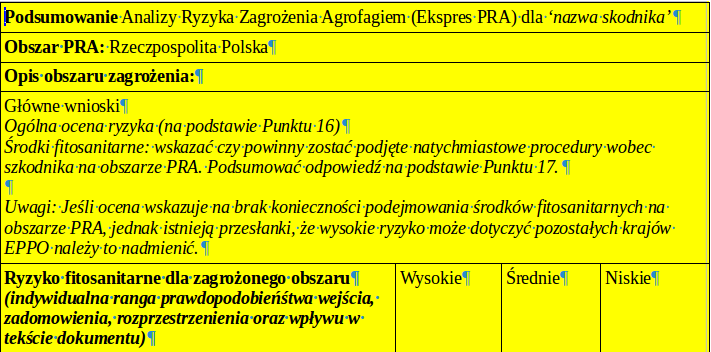
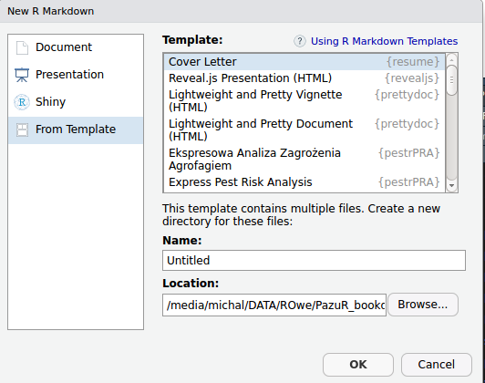

```{r setup, include=FALSE}
knitr::opts_chunk$set(echo = FALSE)
knitr::opts_chunk$set(cache = TRUE)
library('dplyr')
```
# Szablon PRA 

## {.bigger .flexbox .vcenter}

Jak wykorzystać **R** żeby zautomatyzować pisanie raportów?

## Opcje w **R**

> - R Notebook
> - (R)Markdown
> - **bookdown**
> - **blogdown**

## Dlaczego?

> - niesamowita szybkość pisania,
> - spora liczba dostępnych szablonów, 
> - wględna łatwość customizacji,
> - możliwość edycji plików nawet na smartphonie,
> - bezproblemowa współpraca z *git'em*,
> - nie trzeba wychodzić z **RStudio**.

# Alternatywy

## A czy nie lepiej w *Word'zie*? {.emphasized .build .flexbox .vcenter}

<div class="centered">
NIE.
</div>

## Podstawowe wady

Pliki tworzone w edytorach są nieprzenośne. Formatowanie "rozjeżdża się", przy próbie edycji pod różnymi wersjami edytora lub systemu operacyjnego.

Zagnieżdżanie obiektów (tabel, zdjęć, etc.) i dopasowywanie ich do rozmiaru strony jest zadaniem karkołomnym.

Eksport do *pdf* potrafi skutkować błędną strukturą dokumentu (przez co nie spełnia on norm WCAG 2.0).

---

Uczciwość wymaga przyznać, że w edytorach typu WYSIWYG zdecydowanie prościej tworzy się tabele o skomplikowanych formach (łączone komórki, koloryzowane, pola do wyboru).



## To może *InDesign*/*Scribus*?

*InDesign* faktycznie jest potężnym narzędziem, rownież jego cena jest potężna. Jest to genialne narzędzie do tworzenia dokumentów (np. plakatów, broszur) w których pierwszą rolę gra efekt wizualny. *Scribus* jest całkiem niezłym odpowiednikiem freeware'owym, natomiast jest toporny w obsłudze.

## Czysty *LaTeX*? *HTML*?

Zarówno *LaTeX* i *HTML* to świetne narzędzia, oferujące praktycznie nieskończone możliwości obróbki dokumentów. I w zasadzie pliki *Rmd* najczęściej będą kompilowane do tych formatów.

W przeciwieństwie do czystego *LaTeX'a* czy *HTML'a*, (R)Markdown oferuje bardzo uproszczoną składnię, która nie odstrasza początkujących użytkowników i daje nam możliwość integracji **R** -- np. wykresów, importu tabel, obliczeń, wprost do dokumentu. 

Korzystając z gotowych formatek w zasadzie nie trzeba mieć żadnej wiedzy na temat *LaTeX'a* czy *HTML'a*, żeby stworzyć dokument w formie webowej albo *pdf*, które będą wyglądały schludnie.

# Praca z **bookdown**

## Różnice między | **RMarkdown** ...

* rozszerzenie składni **Markdown** -- zbioru znaczników umożliwiających szybkie i wygodne formatowanie i tworzenie tekstów.

## | a **bookdown**

* *nakładka* na **RMarkdown**,
* tworzenie dokumentow/książek składających się z wielu podstron *HTML*,
* tworzenie odnośników do tabel, równań etc. pomiędzy podstronami,
* wsparcie dla pracy na wielu plikach *Rmd* będących w gruncie rzeczy *rozdziałami*,
* możliwość tworzenie wielu formatów wyjściowych na raz.

## Tworzenie szablonów

Najprościej skopiować gotowe szablony formatów, które nas interesują z katalogu pakietu i stopniowo wprowadzać do nich pożadane zmiany.

*Opcja hard-core*: nie ma przeszkód w napisaniu szablonu pliku (np. *html* czy *tex*) od podstaw, ale wymaga to bardzo dużego nakładu pracy i odpowiednich umiejętności.

## Jak napisać tę funkcję?

```{r eval = F, echo = T}
#' @encoding UTF-8
#'
#' @inheritParams rmarkdown::pdf_document
#' @param ... Additional function arguments to pass to the
#'        base R Markdown pdf output formatter
#' @rdname eppoPRA
#' @export

###<b>

eppo_invasive_pdf <- function(toc = F, highlight = "default", ...){

  expressPRA <- bookdown::pdf_document2(template = 'template.tex',
                                        toc = toc,
                                        highlight = highlight, ...)

  expressPRA

###</b>  
  
}
```

---

<div class="columns-2">

* Po zainstalowaniu paczki, należy wybrać `File > New File > R Markdown`.
* W lewym oknie zaznaczamy `From template`.
* Z listy wyboru wybieramy interesujący nas szablon i nadajemy nazwę pliku w odpowiednim okienku.

```{r out.width=c('340px', '405px'), out.height=c('300px', '300px'), fig.show='hold'}

```
</div>

---

W katalogu projektu zostanie utworzony sub-katalog zawierający wszystkie potrzebne pliki. Żeby można było formatkę skompilować trzeba jednak zmienić 2 rzeczy.

- Zmieniamy nazwę pliku, który ma nazwę identyczną z nazwą katalogu na `index.Rmd`
- `Tools > Project options > Build Tools` tutaj należy zmienić pola:
  i) `Project build tools` wybieramy website
  ii) `Site directory` wybieramy nazwę katalogu z plikami szablonu
  iii) `Book output format(s)` wybieramy interesujące nas formaty

## Tricky parts | Tworzenie tabel w (R)Markdown

* Czysty Markdown:

```{r eval = F, echo = T}
| Right | Left | Default | Center |
|------:|:-----|---------|:------:|
| 12 | 12 | 12 | 12 |
| 123 | 123 | 123 | 123 |
```

| Right | Left | Default | Center |
|------:|:-----|---------|:------:|
| 12 | 12 | 12 | 12 |
| 123 | 123 | 123 | 123 |

---

* `knitr::kable()`

```{r echo = T, eval = T}
df <- data.frame(x = c(1, 2), y = c(3, 4))
knitr::kable(df)
```

---

* `knitr::kable()` %>% `kableExtra()`

```{r echo = T, eval = T}
library(kableExtra)
knitr::kable(df, col.names = c('Col1', 'Col2')) %>%
  kable_styling(full_width = T,
                bootstrap_options = c('striped', 'condensed')) %>%
  row_spec(row = 0, bold = T, background = '#f5f6fa') %>%
  row_spec(row = 2, bold = F, background = '#15b0f2', align = "left") %>%
  column_spec(2, width = '20em', color = 'salmon')
```

---

Niby nic trudnego, *ale*:

* `kableExtra` posiada kilka różnic dla *html* i *pdf*, więc przy dużej ilości formatowania tabel, trzeba się posiłkować 
`if (knitr::is_html_output()) {wersja html} else {wersja pdf}`,
* użycie tagu `@cytacja` w tabelach nie jest takie proste jakby się mogło wydawać (o tym za chwilę),
* jeśli nie korzystamy z *default'owych* szablonów, `kableExtra` wymaga edycji pliku `preamble.tex` do poprawnego działania.

## Tricky parts | Abstrakt i strona tytułowa

Żeby dostosować stronę tytułową do naszych potrzeb, niestety trzeba edytować szablony *html* i *tex*. Nie jest to jednak bardzo skomplikowane i typowe problemy są opisane na *Stack Overflow*.

Dla prostego formatowania (np. bez tabeli z łączonymi kolumnami), można w pliku *index.Rmd* użyć nagłówka z atrybutem `{-}` (np. `# Summary {-}`) albo wpisać nasz abstrakt w zmienną `abstract` w części *YAML*.

---

Przy skomplikowanych abstraktach z dużą ilością formatowania może okazać się, że jedynym sensownym rozwiązaniem będzie stworzenie osobnych abstraktów dla różnych formatów. Wtedy można np. abstrakt z formatowaniem *html* zostawić w pliku *index.Rmd* a abstrakt dla wersji *pdf* wywołać z *YAML*.

```{yaml echo = T, eval = F}
abstract: |
  `r if(knitr:::is_latex_output()) paste(readLines("abstract.md"),
                                         collapse = '\n  ')`
```
```{r echo = T, eval = F}
`r if (knitr:::is_html_output()) '# Summary {-}'`

{r echo = F, eval = T, results = 'asis'}
if (knitr::is_html_output()) {
 cat('<div class="abstract-box"><div class="title-box">Summary of the
     Express Pest Risk Analysis for <i>',
     rmarkdown::metadata$pest, '</i></div>')
}
```

## Tricky parts | Cytacje

Cytowanie w **RMarkdown** jest bardzo proste, wystarczy użyć taga `@` i identyfikatora pozycji literaturowej (z pliku *BibTeX*). Chyba, że jako format docelowy wybierzemy *pdf*...

---

W **RMarkdown** cytacje generowane są przez **Pandoc** i w samym tekście działa zarówno składnia **RMarkdown** jak i *LaTeX*. Natomiast jeśli tworzymy tabelę przy użyciu pakietów `kable` i `kableExtra` w rzeczywistości pracujemy na tabelach *LaTeX'owych*, w wyniku czego składnia **RMarkdown** nie działa.

---

Rozwiązanie:

Możemy napisać prostą funckję, która będzie dodawała tagi *LaTeX'owe* wokół zmiennej.

```{r eval = F, echo = T}
formatingCite <- function(x, hyperlink = T) {
  if (hyperlink) {
    paste0('\\citeauthor{', x, '}, ', '\\hyperlink{ref-', x, '}',
           '{\\citeyear{', x, '}}')
} else {
    paste0('\\citeauthor{', x, '}, ', '{\\citeyear{', x, '}}')  
  } 
}
```

---

Następnie piszemy również prostą funkcję, która usunie `@` z identyfikatorów i wykona na każdym z nich funkcję `formatingCite()`.

```{r eval = F, echo = T}
ref_in_table <- function(x, hyperlink = T) {
  x %>%
    gsub('@', '', .) %>%
    strsplit('; ') %>%
    lapply(formatingCite, hyperlink) %>%
    lapply(paste, collapse = '; ') %>% 
    unlist()
}
```

---

Na kolumnie zawierającej cytacje używamy funkcji `mutate()` a następnie podmieniamy *puste* referencje `NA`. Należy pamiętać o dodaniu argumentu `escape = F` do funkcji `kable()`.

```{r eval = F, echo = T}
df <- df %>% mutate(ref = ref_in_table(df$ref, T))

df$ref[df$ref ==
         '\\citeauthor{}, \\citeyear{}' |
       df$ref ==
         '\\citeauthor{}, \\hyperlink{ref-}{\\citeyear{}}'] <- NA

###<b>
knitr::kable(test_table2, 'latex', escape = F)
###</b>

```

# Grand Final | AKA Źródła

##

Prezentacja:

[https://www.github.com/mczyzj/PazuR_bookdown](https://www.github.com/mczyzj/PazuR_bookdown)

[Formatki Pest Risk Assessment w bookdown](https://www.github.com/mczyzj/pestrPRA)

[Przykłady dokumentów z wykorzystaniem powyższych formatek](https://www.github.com/mczyzj/pestrPRA_examples)

[Oryginalne dokumenty](https://bit.ly/2OxVpCA)

[Paczka pestrPRA](https://github.com/mczyzj/pestrPRA)